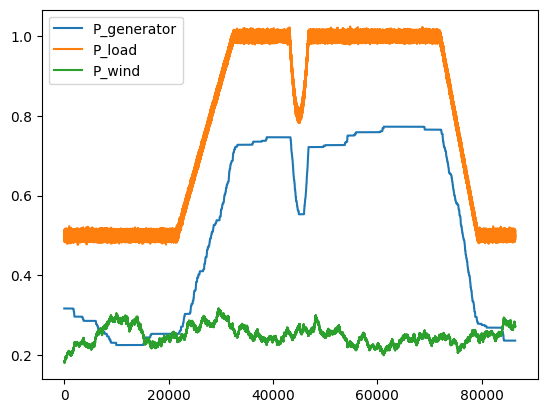
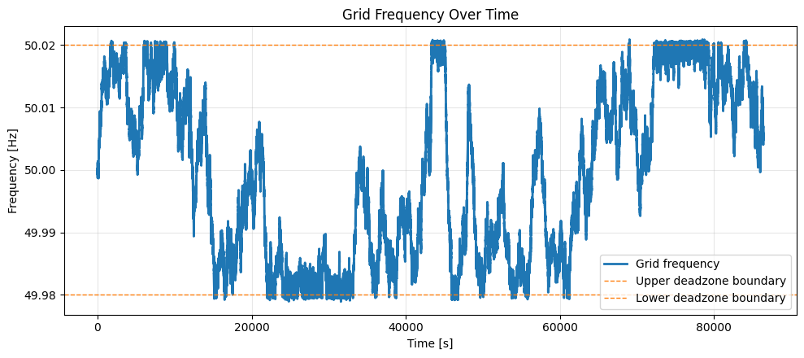

results for generator + load:

grid is stable around 50Hz considering a dt of 5s and assuming the generator can actually change its P_gen in such a short time. In reality, inertia is not acurately modeled here since real-life generators might not be able to change its output in such a short time, also we assume the single generator can provide 1 p.u of required power from the industry (a little more considering white noise)

---

Microgrid with 25% estimated wind power penetration, consisting of SG, wind turbine and load.
SG is controlled with a primary droop control and the main assumption is that the output P_ref of the droop control translates into an "instantaneous" generator output P_gen. The simulation was also implemented with a step dt = 0.1s

Of course, since the generator can freely change its power output with a very fast reaction time, the grid can maintain its stability with only this first order controller.
For a more accurate depiction, a delay function should be also implemented, simulating the time it takes for these changes to take effect