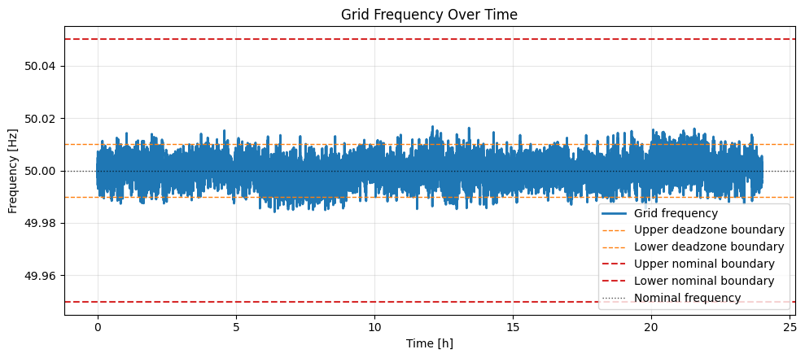

results for generator + load:

grid is stable around 50Hz considering a dt of 5s and assuming the generator can actually change its P_gen in such a short time. In reality, inertia is not acurately modeled here since real-life generators might not be able to change its output in such a short time, also we assume the single generator can provide 1 p.u of required power from the industry (a little more considering white noise)

